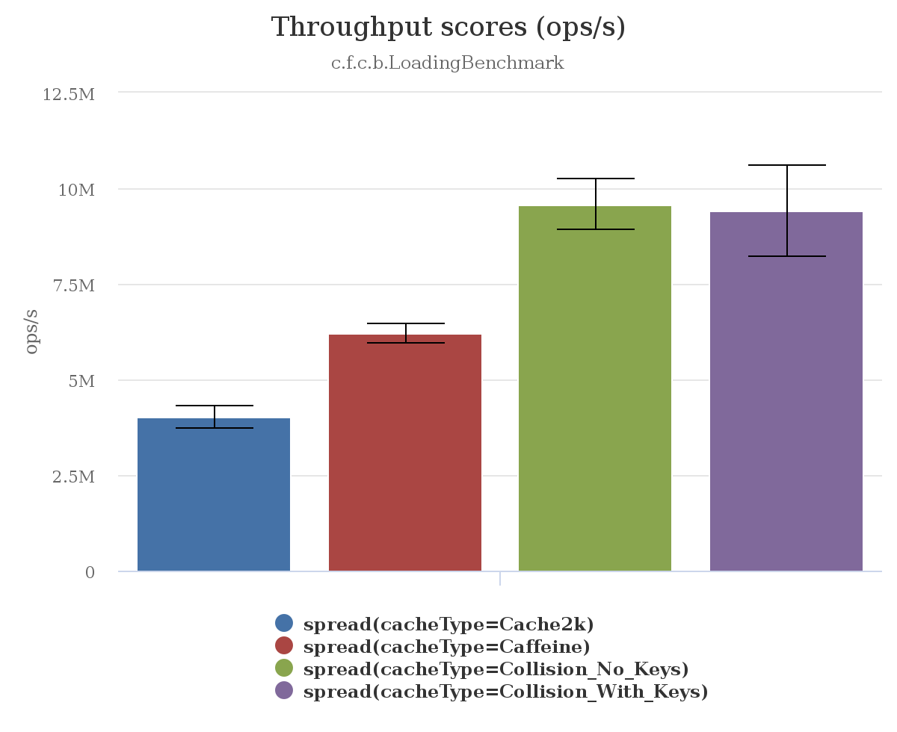
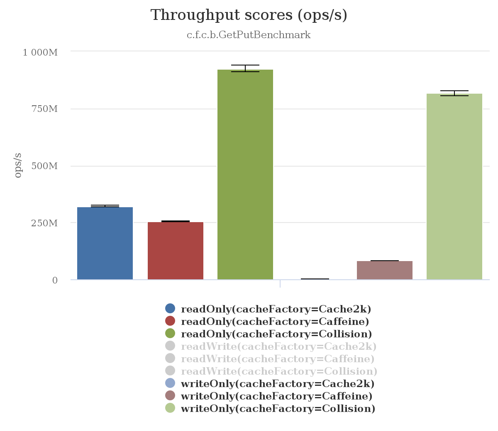
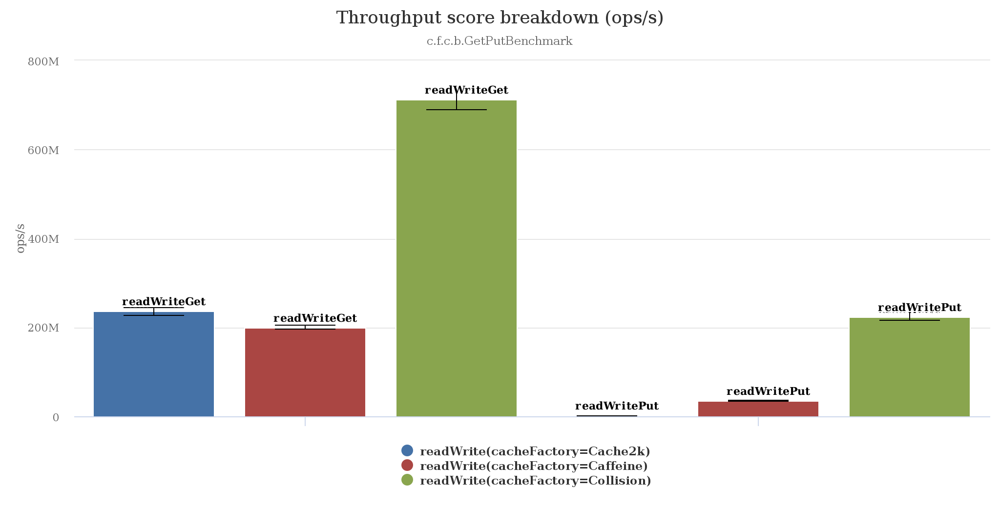

##Collision [](https://travis-ci.org/jamespedwards42/collision) [](https://bintray.com/jamespedwards42/libs/collision/_latestVersion) [](https://raw.githubusercontent.com/collision/jedipus/master/LICENSE)

> Java 9 Fixed Capacity Loading Cache

```java
CollisionCache<Key, Value> cache = CollisionCache
    .<Value>withCapacity(1_048_576)
    .<Key, byte[]>setLoader(
        guid -> loadFromDisk(guid), 
        (guid, loaded) -> deserialize(loaded))
    .setIsValForKey((guid, val) -> ((Value) val).getGUID().equals(guid))
    .buildSparse();
```

###Design Features
* Optional key storage.  If equality can be tested between keys and values with a supplied predicate, e.g., `boolean isValForKey(K key, V val)`, then keys will not be stored.
  * For use cases with large keys relative to the size of values, using that space to store more values may dramatically improve performance.
* Two-phase loading to separate loading of raw data and deserialization/parsing of data.  Helps to prevent unnecessary processing.
* Uses CAS atomic operations as much as possible to optimize for concurrent access.
* Optional user supplied `int hashCode(K key)` function.
* Eviction is scoped to individual hash buckets using an LFU strategy.  With this limited scope, eviction is less intelligent but has very little overhead.
* Compact [8-bit atomic logarithmic counters](src/main/java/com/fabahaba/collision/cache/LogCounterCache.java#L29) inspired by Salvatore Sanfilippo's [blog post on adding LFU caching to Redis](http://antirez.com/news/109), see the section on _Implementing LFU in 24 bits of space_.

###Benchmarks

These benchmarks are intended to mimic those found in the [Caffeine Cache](https://github.com/ben-manes/caffeine/wiki/Benchmarks) project.

######Environment:
* Intel® Xeon(R) CPU E5-2687W v3 @ 3.10GHz × 20 / 128GB Memory / Ubuntu 16.04
* VM: JDK 9-ea+138 / options: -server

####[Loading Benchmark](src/jmh/java/com/fabahaba/collision/benchmarks/LoadingBenchmark.java)

Tests the loading function against a [Zipf](https://en.wikipedia.org/wiki/Zipf%27s_law) distribution of keys.

```java
CollisionCache
  .withCapacity(capacity, Long.class)
  .setStrictCapacity(true)
  .setLoader(
    key -> {
      amortizedSleep(); // Sleeps 1ms every (10.0 / 1000.0)% of calls.
      return key;
    }, (key, num) -> {
      Math.pow(num, 3); // Something else to punish the miss.
      return num;
    })
    .setStoreKeys(false) // Also ran with key storage (true).
    .buildSparse(3.0);
```

> JMH 1.15, 20 threads



####[Get Put Benchmark](src/jmh/java/com/fabahaba/collision/benchmarks/GetPutBenchmark.java)

Tests get and put operations against a cache pre-populated with a [Zipf](https://en.wikipedia.org/wiki/Zipf%27s_law) distribution.

```java
CollisionCache
  .<V>withCapacity(capacity)
  .setStrictCapacity(true)
  .buildSparse(3.0);
```

> JMH 1.15, 16 threads



> JMH 1.15, 12 read threads & 4 write threads




###Implementation Notes & Cache Types
* Collision caches are backed by a large two dimensional array of generic values or java.until.Map.Entry's if storing keys.  Each hash bucket is fixed in length and should be kept small.
* Hash tables are sized as a power of two.  Hash codes for keys are masked against `hashTable.length - 1` for indexing.
* A single large byte[] stores a counter for each possible entry.

####Packed Caches
The number of elements is not explicitly tracked, instead it is limited organically by the number of slots available in the backing hash table.  This might be useful for rare use cases where you can probably fit everything into cache, but it could possibly overflow and need some convenient mechanism to swap out elements.

The number of slots in the hash table is the next power of two greater than `capacity - 1`, e.g., if capacity is 1024, then the number of slots is 1024 and if capacity is 800 then the number of slots is 1024.  The extra space over capacity is given because it is unlikely every slot will be populated.

####Sparse Caches
The number of elements is explicitly tracked and can be strictly limited to `capacity` or allowed to temporarily go over `capacity` and organically decay back down as buckets with multiple entries are accessed.

The number of slots in the hash table is the next power of two greater than `(sparseFactor * capacity) - 1`.

The hash table, a two dimensional array, is completely initialized by default.  If using a large `sparseFactor` consider setting `lazyInitBuckets` to true to save space.

If not strictly limiting the capacity, the number of entries can exceed capacity by:
```
(nextPow2(sparseFactor * capacity - 1) / bucketSize) - (capacity / bucketSize)
```
For this to happen, the same `capacity / bucketSize` buckets would have to perfectly fill up before any other buckets are accessed for writes.
